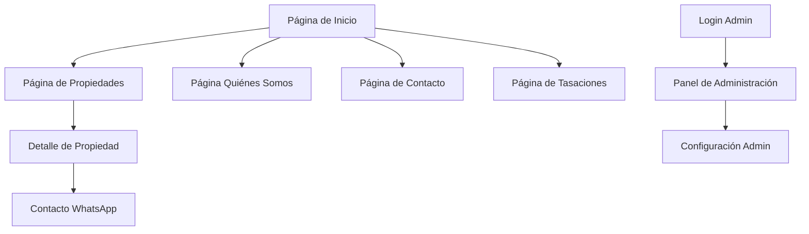

# Documento de Requerimientos del Producto - Iguazú Inmuebles

## 1. Descripción General del Producto

Iguazú Inmuebles es una plataforma web de bienes raíces desarrollada en React que permite a los usuarios buscar, filtrar y visualizar propiedades en venta y alquiler en la región de Iguazú, Argentina. La plataforma incluye funcionalidades administrativas para la gestión de propiedades y un sistema de contacto integrado con WhatsApp.

El proyecto resuelve la necesidad de digitalizar el negocio inmobiliario local, proporcionando una experiencia moderna tanto para clientes como para administradores. Está dirigido a familias y personas que buscan propiedades en la región, así como a la empresa inmobiliaria para gestionar su inventario.

## 2. Características Principales

### 2.1 Roles de Usuario

| Rol | Método de Registro | Permisos Principales |
|-----|-------------------|---------------------|
| Usuario Público | Sin registro requerido | Puede navegar, buscar y filtrar propiedades, contactar vía WhatsApp |
| Administrador | Autenticación con Supabase | Puede crear, editar, eliminar propiedades y gestionar imágenes |

### 2.2 Módulos de Funcionalidad

Nuestros requerimientos del sitio web consisten en las siguientes páginas principales:

1. **Página de Inicio**: sección hero con imagen de fondo, propiedades destacadas, navegación principal
2. **Página de Propiedades**: listado completo con filtros avanzados, vista en grilla/lista, búsqueda por texto
3. **Página de Detalle de Propiedad**: información completa, galería de imágenes, datos de contacto
4. **Página Quiénes Somos**: información sobre la empresa inmobiliaria
5. **Página de Contacto**: formulario de contacto y datos de la empresa
6. **Página de Tasaciones**: formulario para solicitar tasaciones de propiedades
7. **Panel de Administración**: gestión completa de propiedades, imágenes y configuraciones
8. **Configuración de Admin**: ajustes del sistema administrativo

### 2.3 Detalles de Páginas

| Nombre de Página | Nombre del Módulo | Descripción de Funcionalidad |
|------------------|-------------------|------------------------------|
| Página de Inicio | Sección Hero | Mostrar imagen de fondo de Iguazú, título principal, botones de acción para ver propiedades y solicitar tasaciones |
| Página de Inicio | Propiedades Destacadas | Mostrar grid de propiedades marcadas como destacadas con imagen, precio, ubicación y características básicas |
| Página de Propiedades | Sistema de Filtros | Filtrar por tipo de propiedad, operación (venta/alquiler), dormitorios, baños, zona, rango de precios, características especiales |
| Página de Propiedades | Listado de Propiedades | Mostrar propiedades en vista grilla o lista con paginación, ordenamiento por precio/fecha |
| Página de Detalle | Galería de Imágenes | Mostrar carrusel de imágenes de la propiedad con navegación |
| Página de Detalle | Información Completa | Mostrar todos los detalles: precio, características, ubicación, descripción, código de propiedad |
| Página de Contacto | Formulario de Contacto | Capturar nombre, email, teléfono, mensaje y enviarlo por email |
| Página de Tasaciones | Formulario de Tasación | Capturar datos del inmueble para solicitar tasación profesional |
| Panel Admin | Gestión de Propiedades | Crear, editar, eliminar propiedades con formulario completo |
| Panel Admin | Gestión de Imágenes | Subir, ordenar, eliminar imágenes de propiedades |
| Panel Admin | Autenticación | Login/logout con Supabase Auth |
| Componente Global | WhatsApp Flotante | Botón flotante con popup para iniciar conversación en WhatsApp |
| Componente Global | Header Responsivo | Navegación principal con logo, menú responsive, indicador de página activa |
| Componente Global | Footer | Información de contacto, redes sociales, enlaces importantes |

## 3. Proceso Principal

**Flujo de Usuario Público:**
1. El usuario ingresa al sitio web y ve la página de inicio con propiedades destacadas
2. Navega a la sección de propiedades y utiliza filtros para encontrar inmuebles de interés
3. Hace clic en una propiedad para ver los detalles completos
4. Contacta a la inmobiliaria a través del botón de WhatsApp flotante
5. Opcionalmente, solicita una tasación a través del formulario correspondiente

**Flujo de Administrador:**
1. Accede al panel de administración mediante autenticación
2. Gestiona el inventario de propiedades (crear, editar, eliminar)
3. Sube y organiza imágenes para cada propiedad
4. Marca propiedades como destacadas para aparecer en la página principal
5. Actualiza el estado de las propiedades (disponible, vendida, alquilada)

## 4. Diseño de Interfaz de Usuario

### 4.1 Estilo de Diseño

- **Colores primarios**: Rojo oscuro (#8B1E1E) para elementos principales, Verde (#1F5F2D) para botones secundarios
- **Colores secundarios**: Dorado (#FFD700) para acentos, Blanco y grises para fondos
- **Estilo de botones**: Redondeados con efectos hover y transiciones suaves
- **Tipografía**: Fuente Lato para todo el sitio, tamaños variables según jerarquía
- **Estilo de layout**: Diseño limpio y moderno, uso de cards para propiedades, navegación sticky
- **Iconos**: Lucide React para iconografía consistente (búsqueda, calculadora, WhatsApp, etc.)

### 4.2 Resumen de Diseño de Páginas

| Nombre de Página | Nombre del Módulo | Elementos de UI |
|------------------|-------------------|------------------|
| Página de Inicio | Sección Hero | Imagen de fondo de Cataratas del Iguazú, overlay oscuro, título grande en blanco con acento dorado, botones CTA prominentes |
| Página de Inicio | Propiedades Destacadas | Grid responsivo de cards con imagen, precio destacado, ubicación, iconos de características |
| Página de Propiedades | Filtros | Panel lateral/superior con dropdowns, checkboxes, sliders de precio, botón de limpiar filtros |
| Página de Propiedades | Listado | Cards de propiedades con imagen, precio, ubicación, características básicas, botones de vista |
| Detalle de Propiedad | Galería | Carrusel de imágenes con thumbnails, navegación con flechas, zoom opcional |
| Panel Admin | Formularios | Inputs estructurados, dropdowns para categorías, checkboxes para características, botones de acción |
| WhatsApp Flotante | Popup | Botón verde flotante, popup con mensaje predefinido, animaciones de entrada |
| Header | Navegación | Logo de la empresa, menú horizontal en desktop, hamburger en mobile, indicadores de página activa |

### 4.3 Responsividad

El producto está diseñado con enfoque mobile-first y es completamente adaptativo. Incluye optimización para interacciones táctiles en dispositivos móviles, con menús colapsables y botones de tamaño adecuado para touch.