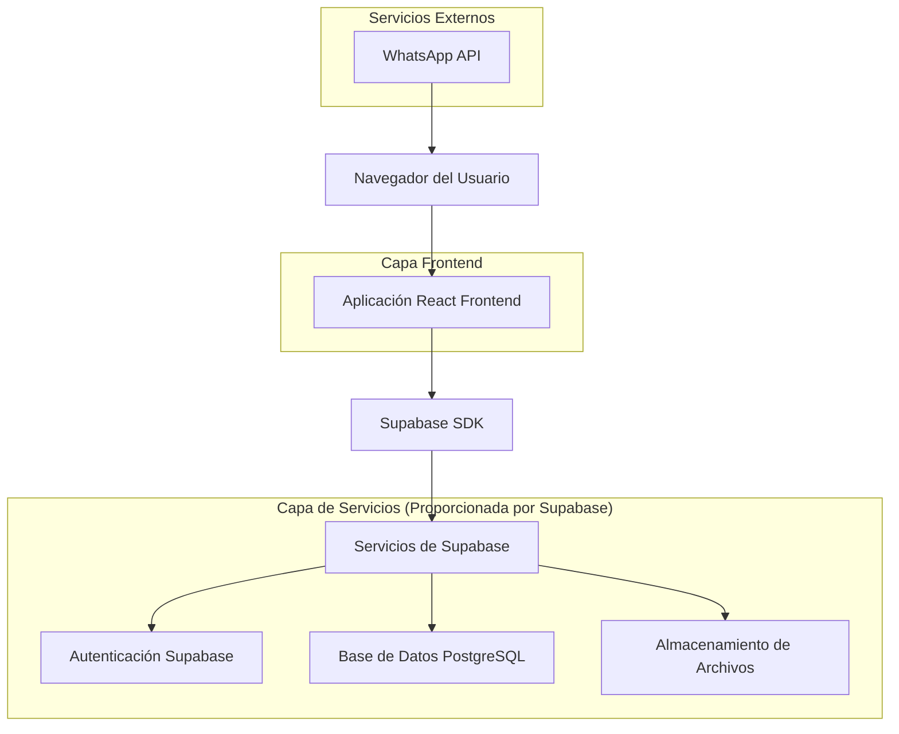
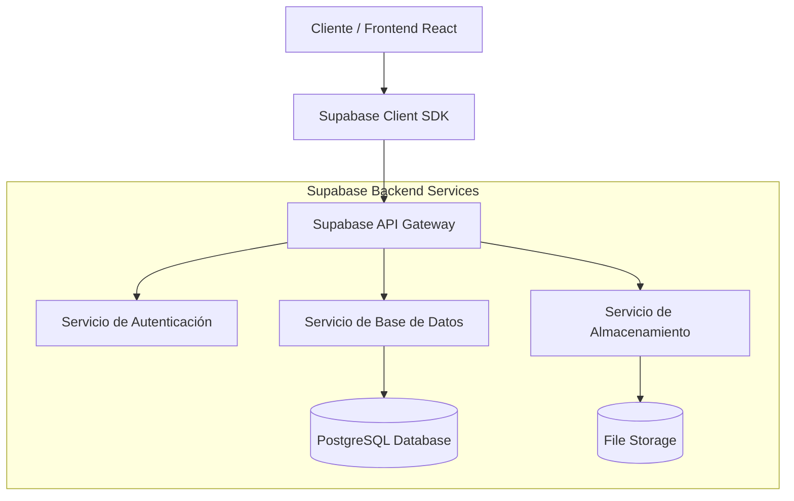
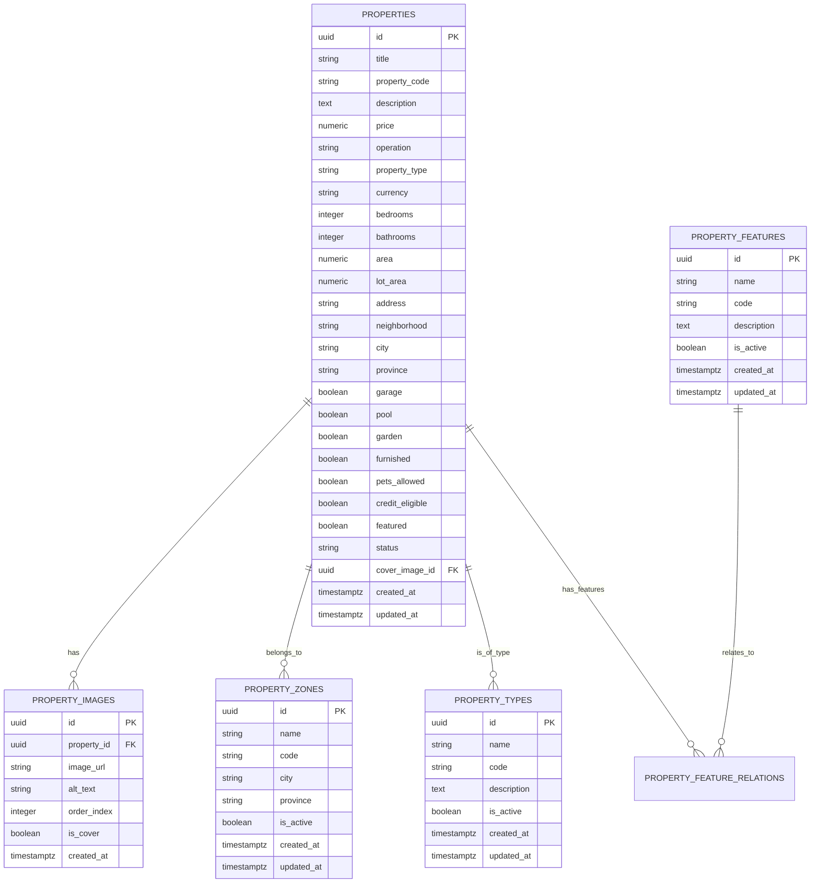

# Documento de Arquitectura Técnica - Iguazú Inmuebles

## 1. Diseño de Arquitectura



## 2. Descripción de Tecnologías

- **Frontend**: React@18 + TypeScript + Vite + TailwindCSS@3
- **Backend**: Supabase (Backend-as-a-Service)
- **Base de Datos**: PostgreSQL (proporcionada por Supabase)
- **Autenticación**: Supabase Auth
- **Enrutamiento**: React Router DOM@7
- **Iconografía**: Lucide React
- **Notificaciones**: React Hot Toast
- **Estilos**: TailwindCSS con configuración personalizada

## 3. Definiciones de Rutas

| Ruta | Propósito |
|------|----------|
| / | Página de inicio con hero section y propiedades destacadas |
| /propiedades | Listado completo de propiedades con filtros avanzados |
| /propiedades/:id | Página de detalle de una propiedad específica |
| /quienes-somos | Información sobre la empresa inmobiliaria |
| /contacto | Formulario de contacto y datos de la empresa |
| /tasaciones | Formulario para solicitar tasaciones de propiedades |
| /admin | Panel de administración para gestión de propiedades |
| /admin/config | Configuración del sistema administrativo |

## 4. Definiciones de API

### 4.1 API Principal de Supabase

**Autenticación de usuarios**
```
POST /auth/v1/token
```

Request:
| Nombre del Parámetro | Tipo de Parámetro | Es Requerido | Descripción |
|---------------------|-------------------|--------------|-------------|
| email | string | true | Email del administrador |
| password | string | true | Contraseña del administrador |

Response:
| Nombre del Parámetro | Tipo de Parámetro | Descripción |
|---------------------|-------------------|-------------|
| access_token | string | Token de acceso JWT |
| user | object | Información del usuario autenticado |

**Obtener propiedades**
```
GET /rest/v1/properties
```

Query Parameters:
| Nombre del Parámetro | Tipo de Parámetro | Es Requerido | Descripción |
|---------------------|-------------------|--------------|-------------|
| select | string | false | Campos a seleccionar |
| status | string | false | Filtro por estado de la propiedad |
| operation | string | false | Filtro por tipo de operación (venta/alquiler) |
| property_type | string | false | Filtro por tipo de propiedad |

Response:
| Nombre del Parámetro | Tipo de Parámetro | Descripción |
|---------------------|-------------------|-------------|
| data | array | Array de propiedades |
| count | number | Número total de registros |

**Crear/Actualizar propiedad**
```
POST /rest/v1/properties
PATCH /rest/v1/properties
```

Request:
| Nombre del Parámetro | Tipo de Parámetro | Es Requerido | Descripción |
|---------------------|-------------------|--------------|-------------|
| title | string | true | Título de la propiedad |
| price | number | true | Precio de la propiedad |
| operation | string | true | Tipo de operación (venta/alquiler) |
| property_type | string | true | Tipo de propiedad |
| address | string | true | Dirección de la propiedad |

Ejemplo:
```json
{
  "title": "Casa en Barrio Jardín",
  "price": 85000000,
  "operation": "venta",
  "property_type": "casa",
  "address": "Av. Mitre 1234",
  "bedrooms": 3,
  "bathrooms": 2,
  "currency": "ARS"
}
```

## 5. Diagrama de Arquitectura del Servidor



## 6. Modelo de Datos

### 6.1 Definición del Modelo de Datos



### 6.2 Lenguaje de Definición de Datos (DDL)

**Tabla de Propiedades (properties)**
```sql
-- Crear tabla de propiedades
CREATE TABLE IF NOT EXISTS properties (
  id uuid PRIMARY KEY DEFAULT gen_random_uuid(),
  title text NOT NULL,
  property_code text,
  description text,
  price numeric NOT NULL,
  operation text NOT NULL CHECK (operation IN ('venta', 'alquiler')),
  property_type text NOT NULL CHECK (property_type IN ('casa', 'departamento', 'terreno', 'local', 'quinta')),
  currency text DEFAULT 'ARS' CHECK (currency IN ('ARS', 'USD')),
  bedrooms integer DEFAULT 0,
  bathrooms integer DEFAULT 0,
  area numeric,
  lot_area numeric,
  address text NOT NULL,
  neighborhood text,
  city text DEFAULT 'Posadas',
  province text DEFAULT 'Misiones',
  garage boolean DEFAULT false,
  pool boolean DEFAULT false,
  garden boolean DEFAULT false,
  furnished boolean DEFAULT false,
  pets_allowed boolean DEFAULT false,
  credit_eligible boolean DEFAULT false,
  featured boolean DEFAULT false,
  status text DEFAULT 'available' CHECK (status IN ('available', 'sold', 'rented')),
  cover_image_id uuid REFERENCES property_images(id),
  created_at timestamptz DEFAULT now(),
  updated_at timestamptz DEFAULT now()
);

-- Crear índices para mejor rendimiento
CREATE INDEX idx_properties_operation ON properties(operation);
CREATE INDEX idx_properties_property_type ON properties(property_type);
CREATE INDEX idx_properties_neighborhood ON properties(neighborhood);
CREATE INDEX idx_properties_status ON properties(status);
CREATE INDEX idx_properties_featured ON properties(featured);
CREATE INDEX idx_properties_currency ON properties(currency);

-- Habilitar RLS (Row Level Security)
ALTER TABLE properties ENABLE ROW LEVEL SECURITY;

-- Políticas de seguridad
CREATE POLICY "Enable read access for all users" ON properties
  FOR SELECT USING (true);

CREATE POLICY "Enable insert for authenticated users"
  ON properties FOR INSERT TO authenticated WITH CHECK (true);

CREATE POLICY "Enable update for authenticated users"
  ON properties FOR UPDATE TO authenticated USING (true);

CREATE POLICY "Enable delete for authenticated users"
  ON properties FOR DELETE TO authenticated USING (true);
```

**Tabla de Imágenes de Propiedades (property_images)**
```sql
-- Crear tabla de imágenes
CREATE TABLE IF NOT EXISTS property_images (
  id uuid PRIMARY KEY DEFAULT gen_random_uuid(),
  property_id uuid REFERENCES properties(id) ON DELETE CASCADE,
  image_url text NOT NULL,
  alt_text text,
  order_index integer DEFAULT 0,
  is_cover boolean DEFAULT false,
  created_at timestamptz DEFAULT now()
);

-- Crear índices
CREATE INDEX idx_property_images_property_id ON property_images(property_id);
CREATE INDEX idx_property_images_order ON property_images(property_id, order_index);
CREATE INDEX idx_property_images_cover ON property_images(is_cover);

-- Habilitar RLS
ALTER TABLE property_images ENABLE ROW LEVEL SECURITY;

-- Políticas de seguridad
CREATE POLICY "Enable read access for all users" ON property_images
  FOR SELECT USING (true);

CREATE POLICY "Enable insert for authenticated users"
  ON property_images FOR INSERT TO authenticated WITH CHECK (true);

CREATE POLICY "Enable update for authenticated users"
  ON property_images FOR UPDATE TO authenticated USING (true);

CREATE POLICY "Enable delete for authenticated users"
  ON property_images FOR DELETE TO authenticated USING (true);

-- Datos iniciales de ejemplo
INSERT INTO properties (
  title, description, price, operation, property_type, bedrooms, bathrooms, 
  area, lot_area, address, neighborhood, garage, pool, garden, featured, credit_eligible
) VALUES 
(
  'Casa en Barrio Jardín',
  'Hermosa casa con amplio jardín, ideal para familias.',
  85000000,
  'venta',
  'casa',
  3,
  2,
  180,
  300,
  'Av. Mitre 1234, Barrio Jardín',
  'Barrio Jardín',
  true,
  false,
  true,
  true,
  true
);
```